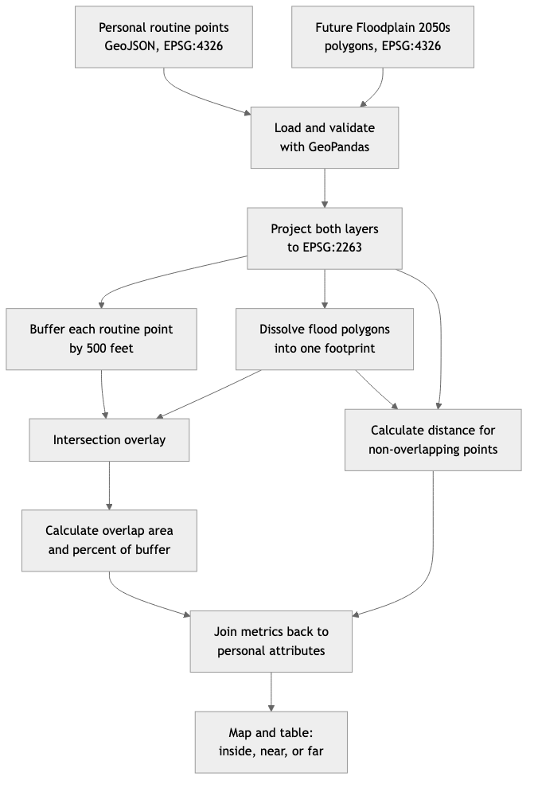

# Assignment 2: Geoprocessing

## Narrative: Places I Visit on Columbia Course Days

I do not live near Columbia, but I regularly visit this area for class. My dataset describes six places that I visit regularly or occasionally on Columbia course days. It begins with class and transit near campus, includes a coffee or study pause, and then moves west toward Riverside Park and the Hudson River. This is therefore a destination-based mental map rather than a map of my home neighborhood. The sequence expresses a shift in my mental image of the city: the campus area feels organized around buildings, schedules, and subway access, while the waterfront feels slower, more open, and more affected by weather and water.

The personal dataset is [02_columbia_hudson_routine.geojson](./02_columbia_hudson_routine.geojson). It is a GeoJSON `FeatureCollection` with six `Point` features in WGS84 longitude/latitude coordinates (`EPSG:4326`). The points are approximate mental-map anchors rather than GPS tracks or exact walking routes.

## Personal Dataset Attributes

| Attribute | Meaning |
|---|---|
| `place_name` | Name of the routine anchor |
| `category` | Type of experience, such as class, transit, study, park, or waterfront |
| `sequence` | Approximate order in the course-day narrative |
| `time_of_day` | Typical part of the day associated with the place |
| `frequency` | How often the place enters the routine |
| `water_relationship` | The place's role in the movement from inland campus space toward the Hudson |
| `personal_note` | Short first-person description of why the place matters |
| `location_precision` | Reminder that some points are approximate |
| `source` | How the feature was created |

## Proposed Related Dataset

I propose relating the personal points to NYC Open Data's [Future Floodplain 2050s](https://data.cityofnewyork.us/Environment/Future-Floodplain-2050s/27ya-gqtm/about_data) polygon dataset. The [GeoJSON API endpoint](https://data.cityofnewyork.us/resource/27ya-gqtm.geojson?$limit=50000) can be loaded directly with GeoPandas.

The flood layer represents the projected 100-year floodplain for the 2050s using FEMA Preliminary Work Map data and a New York City Panel on Climate Change sea-level-rise scenario. Relating it to my routine would connect an experiential mental map to a modeled environmental condition: which familiar places are inside, near, or far from the projected floodplain?

## Proposed Methodology

1. Load the personal point GeoJSON and the Future Floodplain 2050s polygons with GeoPandas.
2. Validate both geometries and confirm their coordinate reference systems.
3. Reproject both layers to `EPSG:2263` so buffering, area, and distance are measured in feet.
4. Create a 500-foot buffer around each personal point. The buffer represents a small activity area around each mental-map anchor, not a claim about the exact route I take.
5. Dissolve the flood polygons into one floodplain footprint to prevent double counting overlapping pieces.
6. Intersect the point buffers with the dissolved floodplain and calculate the amount and percentage of each buffer that overlaps the floodplain.
7. For anchors with no overlap, calculate the shortest distance from the point to the floodplain.
8. Join the overlap and distance results back to the personal attributes, then make a map and a table ordered by exposure or proximity.
9. Interpret the result as a comparison between lived experience and modeled future flood exposure, while keeping the model assumptions and approximate point locations visible.



## Proposed GeoPandas Workflow

```python
import geopandas as gpd

routine = gpd.read_file("02_columbia_hudson_routine.geojson").to_crs(2263)
floodplain = gpd.read_file(
    "https://data.cityofnewyork.us/resource/27ya-gqtm.geojson?$limit=50000"
).to_crs(routine.crs)

buffers = routine.copy()
buffers["geometry"] = buffers.buffer(500)
buffers["buffer_area_sqft"] = buffers.area

flood_union = gpd.GeoDataFrame(
    {"floodplain": ["2050s 100-year floodplain"]},
    geometry=[floodplain.geometry.union_all()],
    crs=routine.crs,
)

overlap = gpd.overlay(buffers, flood_union, how="intersection")
overlap["overlap_sqft"] = overlap.area
overlap["overlap_share"] = overlap["overlap_sqft"] / overlap["buffer_area_sqft"]

distance_to_floodplain = routine.geometry.distance(flood_union.geometry.iloc[0])
routine["distance_to_floodplain_ft"] = distance_to_floodplain
```

## Limits and Interpretation

- The points express a subjective mental map, not an exhaustive log of daily movement.
- Approximate points and a 500-foot buffer simplify the actual spaces where activities occur.
- The floodplain is a scenario-based model, not a prediction that a location will flood on a particular date.
- Point proximity does not measure the accessibility of evacuation routes, building-level elevation, flood depth, or individual vulnerability.
- A useful follow-up would replace the approximate points with an actual walking track and compare route segments, entrances, and elevation rather than point buffers alone.

## Expected Narrative

I expect the inland campus, subway, and coffee points to be farther from the projected floodplain, while the Greenway and West Harlem Piers points should be inside or close to it. The comparison would show that places that feel like part of one short daily routine can have very different relationships to future flood exposure.
