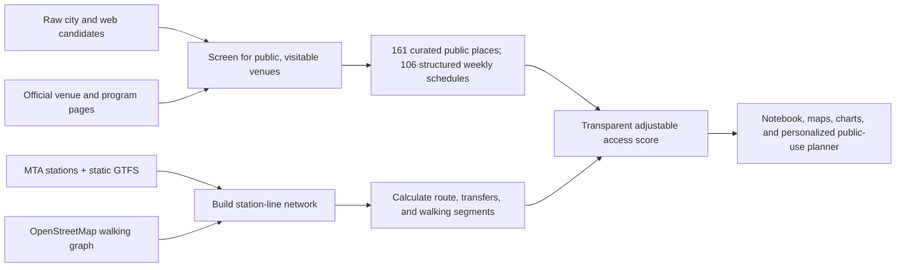

# Culture After Six NYC

**Research question:** When is geographic proximity a poor measure of cultural
access, and how do evening hours, admission price, subway travel, and step-free
proximity change which NYC cultural places are realistically reachable?

This final project expands the Networks assignment into a public-facing mapping
tool. It begins from a personal scenario: finding a cultural place that a
student can actually visit after a class at Columbia GSAPP. The analysis
distinguishes four barriers that are often collapsed into the word
"accessibility":

1. **Spatial access** - Euclidean, walking-network, and station-path distance.
2. **Temporal access** - whether a venue is open at the selected day and time.
3. **Economic access** - standard, student, resident, and free-hour admission.
4. **Mobility access** - walking distance to the nearest ADA-accessible station.

## Project outputs

- `notebooks/culture_after_six_analysis.ipynb`: reproducible analysis and figures.
- `notebooks/culture_after_six_analysis.html`: a no-code, already-rendered version
  of the notebook for presenting or reviewing.
- `data/venues.geojson`: 25 pilot visit profiles with manually checked weekly
  hours and admission rules.
- `data/cultural_places.geojson`: 161 individually screened public cultural
  venues across all five boroughs. Every venue has an official website,
  current-program link, category, description, source-backed visit information,
  and modeled route. One hundred six venues also have structured weekly hours.
- `data/visit_info.json`: admission and opening-schedule information used by
  every public venue card, including fixed prices, pay-what-you-wish rules, and
  event-specific pricing structures.
- `data/current_programs.json`: 16 date-checked exhibitions and programs linked
  to their official event pages.
- `data/subway_stations.geojson`: 496 MTA subway station records.
- `data/subway_network.json`: 1,002 station-line nodes and 4,337 directed edges
  derived from a typical weekday MTA GTFS schedule.
- `site/`: interactive MapLibre application.

## Open the project

The independent public version is available at
[mere0125.github.io/after-six-nyc](https://mere0125.github.io/after-six-nyc/).
The same website is included in `site/` for local review.

From the project root, start the interactive map with:

```bash
cd site
python -m http.server 4173
```

Then open `http://localhost:4173` in a browser. The rendered notebook can be
opened directly without running code. The generated 45 MB walking GraphML is
excluded from this course pull request; it can be recreated from OpenStreetMap
with the scripts in `scripts/`.

## Data sources

- [DCLA Free and Suggested Admission](https://www.nyc.gov/site/dcla/resources/free-and-suggested-admission.page)
- [MTA Subway Stations](https://data.ny.gov/Transportation/MTA-Subway-Stations/39hk-dx4f)
- [MTA Static GTFS](https://data.ny.gov/Transportation/MTA-General-Transit-Feed-Specification-GTFS-Static/fgm6-ccue)
- Individual official venue and current-program pages listed in
  `data/curated_places.json` and `data/current_programs.json`
- OpenStreetMap walking network downloaded with OSMnx

Public access, addresses, official links, and the current-program sample were
checked on August 1, 2026.
Admission policies, opening hours, and programs change, so the website links
back to each venue's official site and current-program page.

## Method



## Interactive product

The website has four connected views:

1. **Explore** ranks all 161 places and calculates a route and arrival time from
   a searched NYC address, a geolocated point, a map click, or the default
   Columbia starting point. Borough and arrival-time availability filters make
   citywide and evening discovery explicit.
2. **On now** presents a date-checked editorial sample of current programs with
   official links. Expired records automatically disappear.
3. **Saved** keeps a shortlist on the current device.
4. **Profile** adjusts recommendations using cultural interests, trip limit,
   budget, admission eligibility, smaller-space preference, and step-free
   priority.

The prototype does not require login. Profile and saved-place data are stored
only in the visitor's browser. This keeps the class prototype usable without a
backend or collecting personal information; a production version could add
optional account sync later.

## Interpretation

The project does not claim to measure all forms of cultural access. A venue may
be close, open, and affordable but still feel unwelcoming or have inaccessible
programming. Conversely, an institution with limited daytime hours may run
events that are highly accessible to a specific community. The tool treats its
results as a practical screening layer, not a universal accessibility ranking.
The subway network uses a typical weekday schedule, a four-minute initial wait,
generic transfer penalties, and estimated walking access and egress. Selected
walking geometry is requested from an OpenStreetMap pedestrian router. It does
not include real-time service changes, elevator outages, buses, ferries, event
sellouts, or station-specific transfer paths. Google Maps directions are linked
for real-world trip confirmation.
